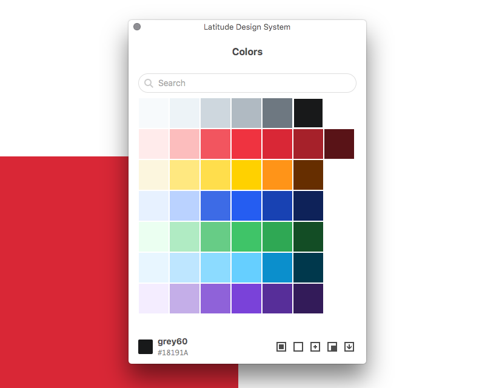

# Latitude Color Swatches for Sketch

A swatches plugin for Sketch (based on [Sketch Swatches](https://github.com/Ashung/Sketch_Swatches/))

Use this plugin to manage your colors in sketch. The plugin contains a list of named Latitude colors and provides the ability to add to the curent fill, current broder, or populate document colors.

[Latitude color guidelines](https://www.flexport.com/design/guidelines/color-system)

## License

Apache 2.0
